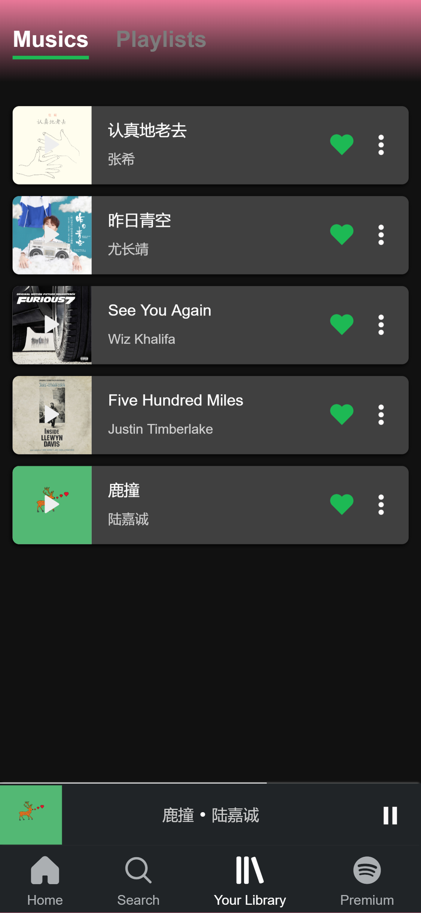

#### 1. 项目介绍
  在刚过完年时，我打算自己做一款手机app，有想过去模仿网易云，但是网易云已经有很多人做过了，于是乎就找到了google play上面人气最高的音乐app  spotify，这款app的交互体验相当不错，于是我决定模仿下。

#### 2. 项目组成
  项目主要分为三个部分，
  1. 前端 (vue vuex vue-router)
  2. [动态图片后端](https://github.com/hhuwc/spotify-img-backend)
  3. [开源网易云api](https://binaryify.github.io/NeteaseCloudMusicApi/#/)
  
  之所以要搞一个python的图片计算后端，是因为要提取图片主要颜色，根据图片不同，来更换不同的背景，这项工作如果要在前端做会比较卡顿，所以直接放到后端做了，并且后端可以缓存计算结果，这样第二次计算时并不会耗时很久。

#### 3.预览
  地址[http://47.102.204.173](http://47.102.204.173)
  
  

    
    
    
    
    
    
  

  

